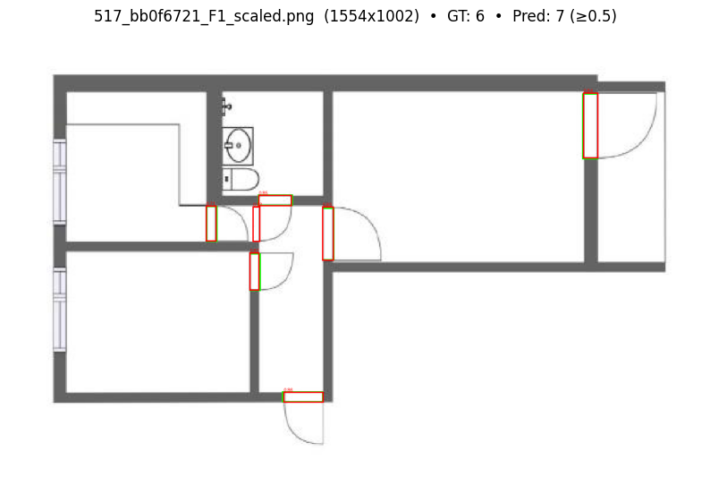
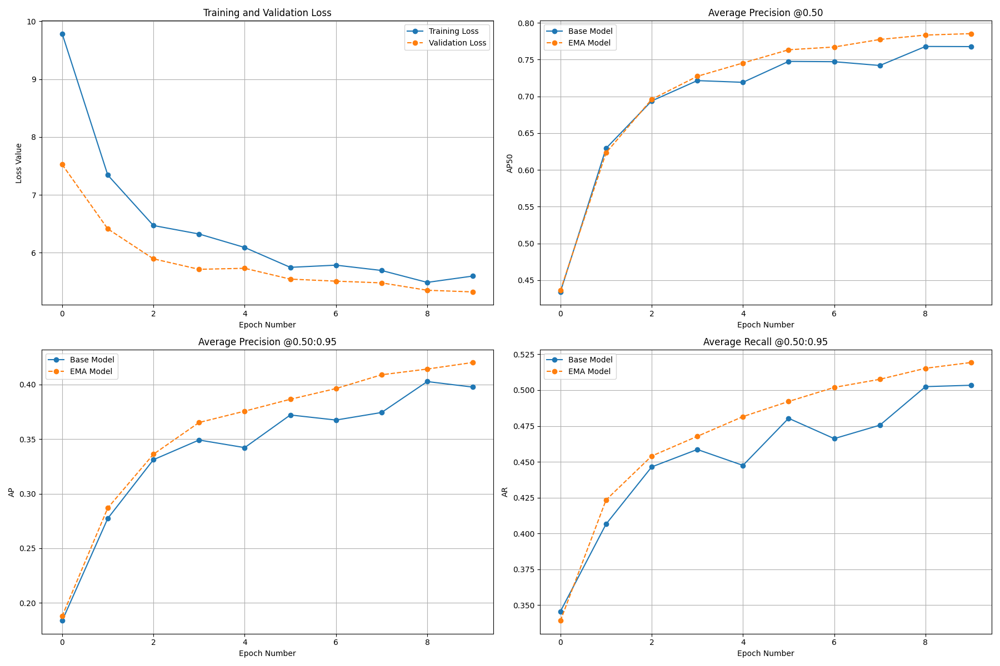

# rf_detr_construction_doors  
Detection model based on **RF-DETR** for door detection in construction/floorplan maps.  

---

## Results  
- **Model:** RF-DETR-Base (~29M params, pretrained on COCO)  
- **Dataset:** 1,000 door examples from **CubiCasa5k** → polygons converted to bboxes, COCO format (80/10/10 split)  
- **Training:** 10 epochs, batch size=4 (grad accum=4), LR=1e-4  
- **Test Performance:** **mAP50 = 0.78**  

---

## Visuals  

**Sample Detection Output**  
  

**Training & Validation Curves**  
  

---

## Notebooks  
- `CubiCasa5k_Door_Explorer.ipynb` → convert & select 1,000 door examples in COCO format  
- `json_coco_set.ipynb` → create train/val/test splits in COCO format  
- `train_ham.ipynb` → training script  
- `inference_ham.ipynb` → inference on images  
- `predict_pdf.ipynb` → run predictions on PDF floorplans  
- `launch_gradio.ipynb` → Gradio demo app  
